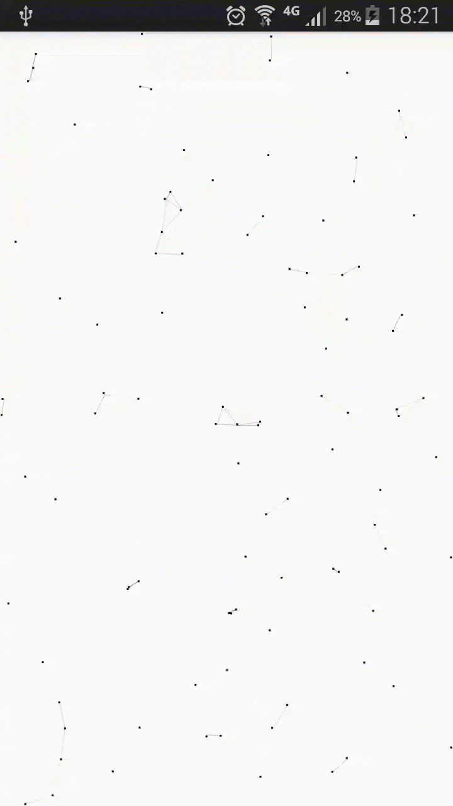

# CanvasNestView
一个效果很赞的背景效果，移植于 [canvas-nest.js](https://github.com/hustcc/canvas-nest.js)。

放置于界面（登录、注册）的底层作为背景，效果相当的不错哦。

# 效果


# 使用
```
compile 'me.fingerart.android:canvasNestView:1.0.0'
```
``` xml
<me.fingerart.library.CanvasNestView
   android:layout_width="match_parent"
   android:layout_height="match_parent"
   app:color_line="#ff000000"
   app:color_point="#ff000000"
   app:count_point="99"
   app:max_distance="100" />
```

# 属性说明
| 属性 | 说明 |
| ------------- | ----------------- |
| color_line    | 点与点之间的连线颜色 |
| color_point   | 点的颜色           |
| count_point   | 点的总数           |
| max_distance  | 点与点连线的最大距离 |


